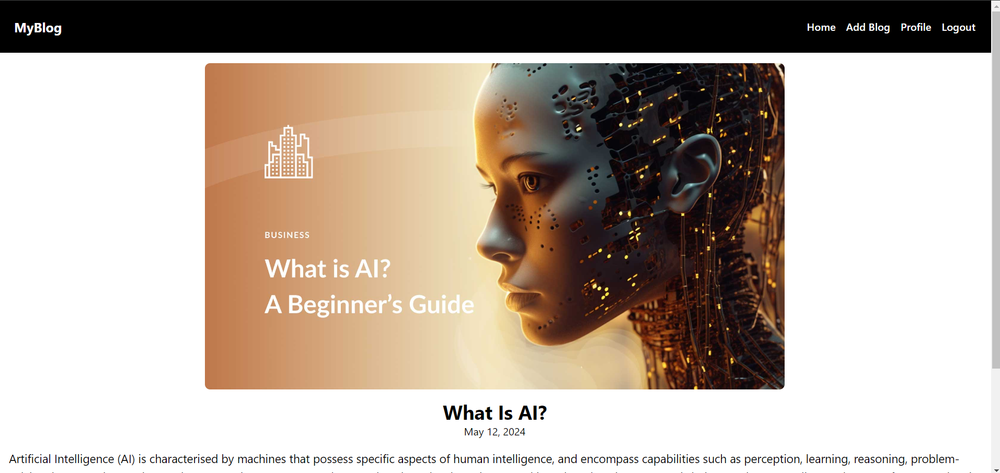

# MyBlog-Django
MyBlog is a Django web application featuring user authentication, enabling users to register, log in, and log out. Once authenticated, users can browse and view blog posts submitted by others, as well as create and publish their own blog posts within the platform.

## Overview

